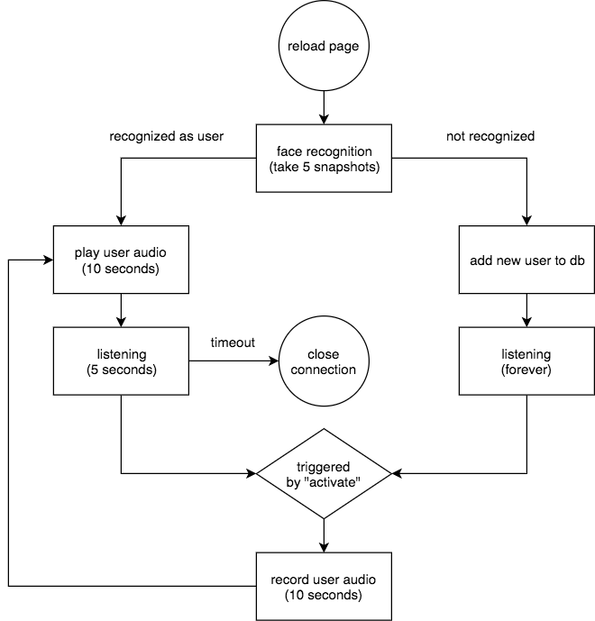

# Daily Mirror

## Motivation
Want to be recognized and greeted every time I looked into the mirror.

## Usage

### Prepare
1. Install Anaconda.
2. Setup environment using the 'environment.yml' file.
3. Activate the environment you just built.
4. Run command `uwsgi --master --http:5000 --http-websockets --gevent 100 --wsgi mirror:app --disable-logging`
5. Open `http://17.0.0.1:5000/` in your web browser.

### Run
Recognize faces at page reloading, trigger word is "activate".

## Methods
Web Service: Flask.

Face Recognition: Facenet method.

Trigger Word Detection: RNN related.

## Reference
[1] Coursera Deep Learning Specialization

[2] https://henri.io/posts/streaming-microphone-input-with-flask.html

[3] https://www.dlology.com/blog/how-to-do-real-time-trigger-word-detection-with-keras/

[4] https://blog.miguelgrinberg.com/post/the-flask-mega-tutorial-part-i-hello-world

[5] https://github.com/keras-team/keras/issues/2397